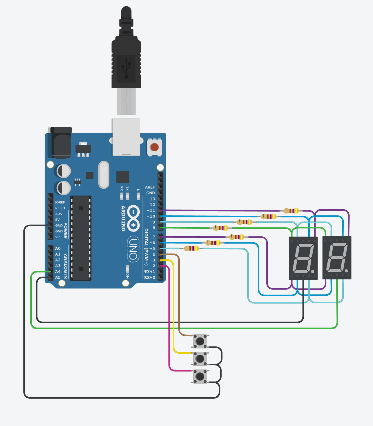
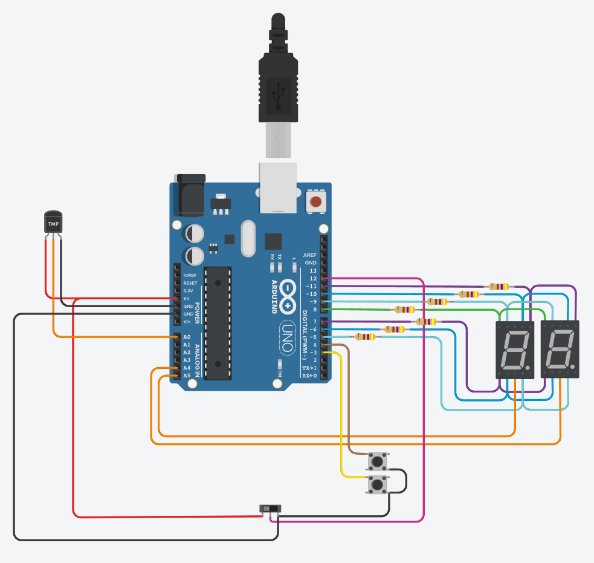

## Integrantes 
- Roman Tomas
- Novach Jeronimo
- Sotelo Lucas

## 1° Parte - Proyecto: Contador de 0 a 99 con Display 7 Segmentos y Multiplexación.

## Descripción
La primera parte de nuestro proyecto consiste en crear un contador desde el 0-99 utilizando 2 displays de 7 segmentos aplicando la tecnica de Multiplexacion. Contiene 3 pulsadores con funcionalidades distintas; uno de ellos suma el contador, otro resta y el ultimo resetea el contador a 0.
Ademas, incluye mecanismos para evitar rebotes en los pulsadores!

## Función principal
Esta funcion se encarga de encender y apagar los leds que se necesiten para formar el numero que corresponde con el contador en cada caso.

a, b, c, d, e, f, g son #define que utilizamos para agregar los leds de los displays, asociandolo a pines de la placa arduino.

~~~ C++ (lenguaje en el que esta escrito)
void mostrar_digito(int digit){
  
    digitalWrite(a,HIGH);
    digitalWrite(b,HIGH);
    digitalWrite(c,HIGH);
    digitalWrite(d,HIGH);
    digitalWrite(e,HIGH);
    digitalWrite(f,HIGH);
    digitalWrite(g,LOW);
  
    switch(digit){
      
        case 1:
            digitalWrite(a,LOW);
            digitalWrite(b,HIGH);
            digitalWrite(c,HIGH);
            digitalWrite(d,LOW);
            digitalWrite(e,LOW);
            digitalWrite(f,LOW);
            digitalWrite(g,LOW);
            break;
        case 2:
            digitalWrite(a,HIGH);
            digitalWrite(b,HIGH);
            digitalWrite(c,LOW);
            digitalWrite(d,HIGH);
            digitalWrite(e,HIGH);
            digitalWrite(f,LOW);
            digitalWrite(g,HIGH);
            break;
        case 3:
            digitalWrite(a,HIGH);
            digitalWrite(b,HIGH);
            digitalWrite(c,HIGH);
            digitalWrite(d,HIGH);
            digitalWrite(e,LOW);
            digitalWrite(f,LOW);
            digitalWrite(g,HIGH);
            break;
        case 4:
            digitalWrite(a,LOW);
            digitalWrite(b,HIGH);
            digitalWrite(c,HIGH);
            digitalWrite(d,LOW);
            digitalWrite(e,LOW);
            digitalWrite(f,HIGH);
            digitalWrite(g,HIGH);
            break;
        case 5:
            digitalWrite(a,HIGH);
            digitalWrite(b,LOW);
            digitalWrite(c,HIGH);
            digitalWrite(d,HIGH);
            digitalWrite(e,LOW);
            digitalWrite(f,HIGH);
            digitalWrite(g,HIGH);
            break;
        case 6:
            digitalWrite(a,HIGH);
            digitalWrite(b,LOW);
            digitalWrite(c,HIGH);
            digitalWrite(d,HIGH);
            digitalWrite(e,HIGH);
            digitalWrite(f,HIGH);
            digitalWrite(g,HIGH);
            break;
        case 7:
            digitalWrite(a,HIGH);
            digitalWrite(b,HIGH);
            digitalWrite(c,HIGH);
            digitalWrite(d,LOW);
            digitalWrite(e,LOW);
            digitalWrite(f,LOW);
            digitalWrite(g,LOW);
            break;
        case 8:
            digitalWrite(a,HIGH);
            digitalWrite(b,HIGH);
            digitalWrite(c,HIGH);
            digitalWrite(d,HIGH);
            digitalWrite(e,HIGH);
            digitalWrite(f,HIGH);
            digitalWrite(g,HIGH);
            break;
        case 9:
            digitalWrite(a,HIGH);
            digitalWrite(b,HIGH);
            digitalWrite(c,HIGH);
            digitalWrite(d,HIGH);
            digitalWrite(e,LOW);
            digitalWrite(f,HIGH);
            digitalWrite(g,HIGH);
            break;
      }
  }
~~~

## 2° Parte - Proyecto: Modificación con Interruptor Deslizante y Números Primos.

## Descripción
En la segunda parte de nuestro proyecto realizamos varias de las siguientes modificaciones: 
 
 
ELIMINADOS:
- Boton reset --> (se encargaba de setear el contador a 0 con el fin de reiniciar el programa)

AGREGADOS:
- Interruptor deslizante o Switch.

## :robot: Link al proyecto
- [proyecto](https://www.tinkercad.com/things/eAtVA3PDnj8)
---
### Fuentes

- [Tutorial](https://www.youtube.com/watch?v=_Ry7mtURGDE&list=PL7LaR6_A2-E11BQXtypHMgWrSR-XOCeyD&index=4).
- [Insertar Imagen](https://www.youtube.com/watch?v=lWeEF5fmdko).
- [Emojis](https://gist.github.com/rxaviers/7360908).

---

